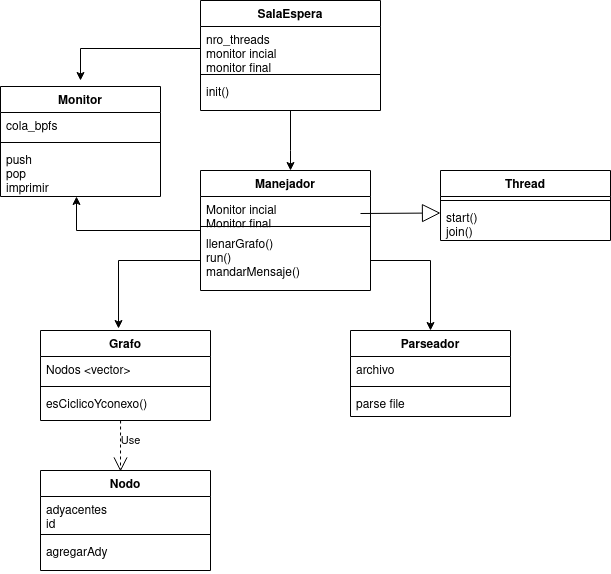

# Taller de programación I 7542

### Nombre y apellido: Lucía Pardo

### Padrón: 99999

### Repositorio: https://github.com/luciaPardo/tp2

### 2do cuatrimestre de 2020

# Verificador eBPF

## Introducción: 
Para este trabajo práctico se implementó un verificador de varios archivos bpf, implementando con multi hilos. 

## Modelo

Para lograr el tp, se comenzó intentando plantear un modelo de clases en las cuales se pudieran comunicar entre sí, y tratando de abstraer comportamientos. Durante el desarrollo sirvió de guía y se tuvieron que realizar mínimos cambios, llegando a este resultado:

## Reentrega:

Se arregló el grafo y las funciones de dfs y detectarCiclo, agregando un número de identificador a los nodos y poder comparar ese número en vez de un booleando con el visitado. 

Se corrigió la clase monitor ya que de la forma que estaba implementado presentaba race conditions a la hora de sacar elementos de la cola que era un objeto compartido entre threads. Se presentaba un problema ya que se checkeaba por separado que hubiera elementos en la cola, y luego se eliminaban, presentando la posibilidad que mientras hubiera dado true la condición de que había elementos otro thread eliminara el último elemento y así cuando el primero intentara extraerlo se produciese un error. Para pushear los elementos se separó el método que se utilizaba al principio donde se insertan todos los archivos aún cuando todavía no se inicializaron los threads, por lo que no hacía falta un mutex para protegerlo y el push en donde se van guardando los elementos una vez que se procesó el archivo, donde únicamente se puso un mutex porque no importa en qué orden son insertados los elementos, ya que luego cuando se cerraron todos los threads se realiza el ordenado de los mismos. 

El modelo inicial de las clases se mantuvo y se cambió un nombre a la ex clase SalaEspera quedando de la siguiente forma:

