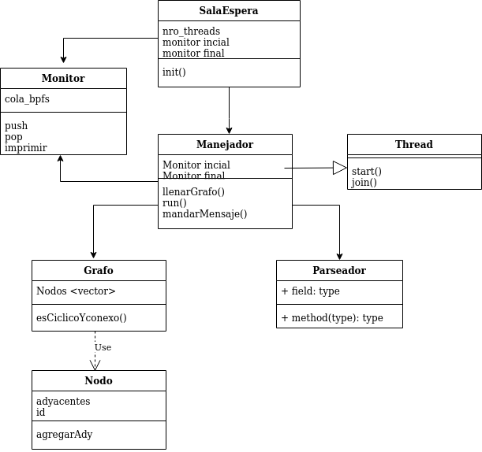

# Taller de programación I 7542

### Nombre y apellido: Lucía Pardo

### Padrón: 99999

### Repositorio: https://github.com/luciaPardo/tp2

### 2do cuatrimestre de 2020

# Verificador eBPF

## Introducción: 
Para este trabajo práctico se implementó un verificador de varios archivos bpf, implementando con multi hilos. 

## Modelo

Para lograr el tp, se comenzó intentando plantear un modelo de clases en las cuales se pudieran comunicar entre sí, y tratando de abstraer comportamientos. Durante el desarrollo sirvió de guía y se tuvieron que realizar mínimos cambios, llegando a este resultado:

## Reentrega:

Se arregló el grafo y las funciones de dfs y detectarCiclo, agregando un número de identificador a los nodos y podesr comparar ese número en vez de un booleando con el visitado. Se corrigió la clase monitor ya que de la forma que estaba implementado presentaba race conditions a la hora de insertar y sacar elementos de la cola que era un objeto compartido entre threads.
El modelo inicial de las clases se mantuvo.

